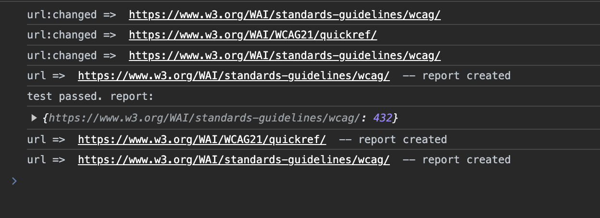

# Cypress async plugin demo

Here is a simple example of Cypress plugin that waits for URL change and counts DOM nodes.
Timeout was added to emulate more complex logic that I have in the initial plugin.

But even here you can see that Cypress doesn't wait for nodes counter logic execution and finishes the test before it.

## Output

Here is an output from test execution, as you can see some checks are finished after the test is done, ideally report should contain results from all ( 3 ) scheduled tasks after URL change.

In real implementation, that was omitted for simplification, other asyc Cypress API can be called which increases execution time and also can lead to incorrect output.
( plugin code saves screenshots, save page source, etc )

Note: In this sample scenario I haven't mentioned Mutation Observer implementation but it is also used in the original plugin code.